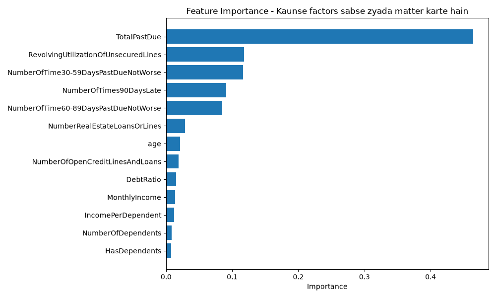

# Credit Risk Predictor

An end-to-end machine learning system that predicts the probability of a loan applicant defaulting within 2 years, built for Razorpay Buildathon (Open Track).

**Why Open Track:** Credit risk prediction is a well-understood, high stakes ML problem — one where the interesting work isn't just training a model, but handling messy real world data, an extreme class imbalance, and making the model's decisions explainable. I chose to go deep on this problem rather than force fit it into a narrower track it didn't quite match.

**[Live Demo](https://creditriskpredictor-dedujnq5cgkfm8pmtgdzkb.streamlit.app/)** · **[Video Walkthrough](#)**
---

## What it does

Given an applicant's financial profile income, existing debt, credit utilization, and payment history. The model outputs a default probability and a risk tier (Low / Medium / High). It's designed to sit upstream of a loan approval decision, giving a lender a fast, explainable signal on applicant risk.



---

## Why this matters

Manual credit risk assessment is slow, inconsistent, and hard to scale. A model like this doesn't replace a human underwriter it gives them a fast, explainable first pass, so they can focus attention on borderline cases instead of re evaluating every applicant from scratch.

---

## Dataset

[Give Me Some Credit](https://www.kaggle.com/c/GiveMeSomeCredit/data) (Kaggle) — 150,000 historical loan records with 10 financial features and a binary default label (`SeriousDlqin2yrs`).

**Key challenge: severe class imbalance.** Only 6.7% of applicants in the dataset defaulted. A model that just predicts "no default" for everyone would already be 93% accurate and completely useless. This shaped every downstream decision, from the evaluation metric (ROC-AUC and recall, not accuracy) to the modeling approach (class weighting).

---

## Pipeline

**1. Data Cleaning**
- Dropped 1 row with `age = 0` (impossible value)
- Removed 269 rows (~0.18%) where late payment columns had values of 96/98 — these are known placeholder/error codes in this dataset, not real counts
- Capped `DebtRatio` and `RevolvingUtilizationOfUnsecuredLines` at 2.0 — both are meant to be ratios but had outliers in the thousands, caused by near zero income values in the denominator
- Imputed missing `MonthlyIncome` (20% missing) and `NumberOfDependents` (2.6% missing) with median values

**2. Feature Engineering**
- `TotalPastDue` — sum of all late-payment counts (30-59, 60-89, 90+ days). Turned out to be the single strongest predictor.
- `HasDependents` — binary flag for whether the applicant has any dependents
- `IncomePerDependent` — income adjusted for household size

**3. Modeling**
Two models were trained and compared:

| Model | ROC-AUC | Recall (default class) | Precision (default class) |
|---|---|---|---|
| Logistic Regression (baseline) | 0.848 | 0.72 | 0.22 |
| XGBoost (default params) | 0.839 | 0.67 | 0.23 |
| **XGBoost (tuned)** | **0.859** | **0.75** | 0.21 |

The tuned XGBoost model was selected as final. `scale_pos_weight` was used to handle class imbalance instead of resampling, to avoid distorting the feature distributions.

**Why recall over precision:** In credit risk, a missed defaulter (false negative) is typically far more costly to a lender than a false alarm on a safe applicant (false positive) — a missed default means real financial loss, while a false alarm just means extra manual review. The model was tuned with this asymmetry in mind.

**4. Explainability**
SHAP (TreeExplainer) was used to understand not just *which* features matter, but *how* — e.g., confirming that high `TotalPastDue` and high credit utilization push predictions toward "risky," while older age pushes toward "safe," consistent with real world credit risk intuition.

**5. Deployment**
A Streamlit dashboard takes applicant details as input and returns a live risk score with a plain language explanation of what's driving it.

---

## What broke, and how it got fixed

Two real issues came up during development — documenting them here rather than hiding them, since debugging is most of the job:

**1. SHAP API mismatch.** `explainer.shap_values(X_sample)` threw an `IndexError` inside `shap.summary_plot()`. The root cause was a version difference — newer SHAP releases changed the expected output format of `shap_values()`. Fix: switched to the newer `explainer(X_sample)` call, which returns an `Explanation` object that `summary_plot` handles natively, instead of a raw array.

**2. Streamlit type error on the progress bar.** `st.progress(risk_probability)` crashed with `StreamlitAPIException: Progress Value has invalid type: float32`. XGBoost's `predict_proba()` returns NumPy `float32` values, not native Python floats, and Streamlit's `st.progress()` only accepts the latter. Fix: wrapped the value in `float()` before passing it in.

---

## Tech Stack

Python · pandas · scikit-learn · XGBoost · SHAP · Streamlit

## Running it locally

```bash
git clone https://github.com/bhumi21005/credit_risk_predictor.git
cd credit_risk_predictor
python -m venv venv
venv\Scripts\activate        # Windows
pip install -r requirements.txt
streamlit run app.py
```

## Limitations & Next Steps

- Trained on a single historical dataset (2000s-era US credit data) — would need recalibration against current, region-specific data before any real-world use
- No batch scoring yet — currently one applicant at a time via the UI
- Precision on the default class is low (21%) by design, given the recall-first tuning choice — a production system would pair this score with a human review step for flagged cases, not auto-reject

---


