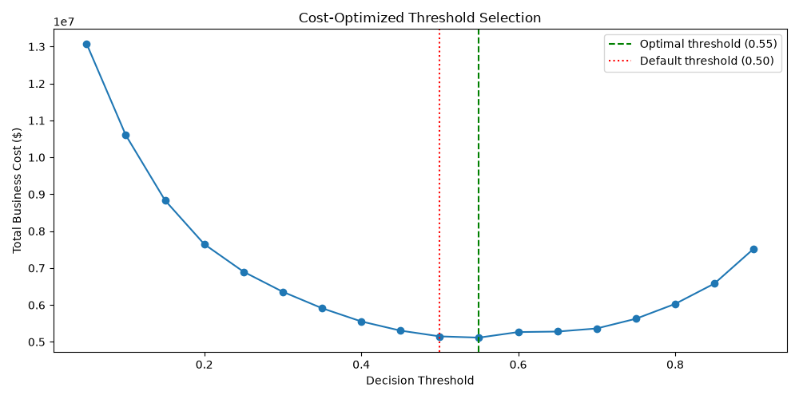

# Credit Risk Predictor

An end-to-end machine learning system that predicts the probability of a loan applicant defaulting within 2 years..

Credit risk prediction is a well-understood, high-stakes ML problem — one where the interesting work isn't just training a model, but handling messy real world data, an extreme class imbalance, and making the model's decisions explainable and business actionable. I chose to go deep on this problem.

**[Live Demo](https://creditriskpredictor-dedujnq5cgkfm8pmtgdzkb.streamlit.app/)**

---

## What it does

Given an applicant's financial profile — income, existing debt, credit utilization, and payment history — the model outputs a default probability, a risk tier (Low / Medium / High), and a cost-optimized approve/reject decision. It supports both single-applicant lookups and batch scoring of many applicants at once via CSV upload.


---

## Why this matters

Manual credit risk assessment is slow, inconsistent, and hard to scale. A model like this doesn't replace a human underwriter — it gives them a fast, explainable, cost-aware first pass, so they can focus attention on borderline cases instead of re-evaluating every applicant from scratch.

---

## Dataset

[Give Me Some Credit](https://www.kaggle.com/c/GiveMeSomeCredit/data) (Kaggle) — 150,000 historical loan records with 10 financial features and a binary default label (`SeriousDlqin2yrs`).

**Key challenge: severe class imbalance.** Only 6.7% of applicants in the dataset defaulted. A model that just predicts "no default" for everyone would already be 93% accurate — and completely useless. This shaped every downstream decision, from the evaluation metric (ROC-AUC and recall, not accuracy) to the modeling approach (class weighting) to the final decision threshold (see below).

---

## Pipeline

**1. Data Cleaning**
- Dropped 1 row with `age = 0` (impossible value)
- Removed 269 rows (~0.18%) where late-payment columns had values of 96/98 — known placeholder/error codes in this dataset, not real counts
- Capped `DebtRatio` and `RevolvingUtilizationOfUnsecuredLines` at 2.0 — both are meant to be ratios but had outliers in the thousands, caused by near-zero income values in the denominator
- Imputed missing `MonthlyIncome` (20% missing) and `NumberOfDependents` (2.6% missing) with median values

**2. Feature Engineering**
- `TotalPastDue` — sum of all late-payment counts (30-59, 60-89, 90+ days). The single strongest predictor.
- `HasDependents` — binary flag for whether the applicant has any dependents
- `IncomePerDependent` — income adjusted for household size

**3. Modeling**
Two models were trained and compared:

| Model | ROC-AUC | Recall (default class) | Precision (default class) |
|---|---|---|---|
| Logistic Regression (baseline) | 0.848 | 0.72 | 0.22 |
| XGBoost (default params) | 0.839 | 0.67 | 0.23 |
| **XGBoost (tuned)** | **0.859** | **0.75** | 0.21 |

The tuned XGBoost model was selected as final. `scale_pos_weight` was used to handle class imbalance instead of resampling, to avoid distorting the feature distributions.

**4. Explainability**
SHAP (TreeExplainer) was used to understand not just *which* features matter, but *how* — confirming that high `TotalPastDue` and high credit utilization push predictions toward "risky," while older age pushes toward "safe," consistent with real-world credit risk intuition.

**5. Cost-Based Decision Threshold**
The default 0.5 classification cutoff is arbitrary — it ignores the fact that a missed defaulter (false negative) and a wrongly-rejected safe applicant (false positive) don't cost a lender the same amount. Using rough business estimates (~$5,000 lost on a missed defaulter vs. ~$500 in lost profit on a wrongly-rejected applicant), I swept thresholds from 0.05 to 0.95 and computed total expected cost at each:



The cost-minimizing threshold turned out to be **0.55**, slightly higher than the naive 0.5 default, saving an estimated ~$34,000 in total cost across the test set (~30,000 applicants) relative to the default cutoff. The deployed app uses this threshold to generate its approve/reject recommendation, not just a raw probability.

**6. Batch Scoring**
Beyond scoring one applicant at a time, the app supports uploading a CSV of multiple applicants — returning a scored table (risk %, tier, decision), a downloadable results CSV, and a risk-distribution chart. This reflects how a real lending system would actually be used: scoring a queue of applications, not one form submission at a time.

**7. Testing**
5 unit tests (`pytest`) cover: valid probability output range, correctness of feature engineering (`TotalPastDue`, `HasDependents`), a model sanity check (higher past-due history must increase predicted risk), and column integrity after feature engineering. All passing.

---

## What broke, and how it got fixed

Documenting real issues here rather than hiding them, since debugging is most of the job:

**1. SHAP API mismatch.** `explainer.shap_values(X_sample)` threw an `IndexError` inside `shap.summary_plot()`. Root cause: a version difference — newer SHAP releases changed the expected output format of `shap_values()`. Fix: switched to the newer `explainer(X_sample)` call, which returns an `Explanation` object that `summary_plot` handles natively.

**2. Streamlit type error on the progress bar.** `st.progress(risk_probability)` crashed with `StreamlitAPIException: Progress Value has invalid type: float32`. XGBoost's `predict_proba()` returns NumPy `float32`, not native Python floats, and Streamlit's `st.progress()` only accepts the latter. Fix: wrapped the value in `float()`.

**3. Cloud deployment failure.** The app failed to deploy on Streamlit Community Cloud with "Error installing requirements." Root cause: `requirements.txt` was generated via `pip freeze`, which captured every package in the local virtual environment — including Windows-specific and unrelated packages that don't exist on Streamlit's Linux servers. Fix: replaced it with a minimal, hand-picked list of only the packages the app actually imports.

---

## Tech Stack

Python · pandas · scikit-learn · XGBoost · SHAP · Streamlit · pytest

## Running it locally

```bash
git clone https://github.com/bhumi21005/credit_risk_predictor.git
cd credit_risk_predictor
python -m venv venv
venv\Scripts\activate        # Windows
pip install -r requirements.txt
streamlit run app.py
```

Run tests with:
```bash
pytest tests/ -v
```

## Limitations & Next Steps

- Trained on a single historical dataset (2000s-era US credit data) — would need recalibration against current, region-specific data before any real-world use
- The $5,000 / $500 cost assumptions behind the optimized threshold are illustrative estimates, not figures from a real lending business — in production these would come from actual loss data
- Precision on the default class is low (21%) by design, given the recall-first tuning choice — a production system would pair this score with a human review step for flagged cases, not auto-reject

---

